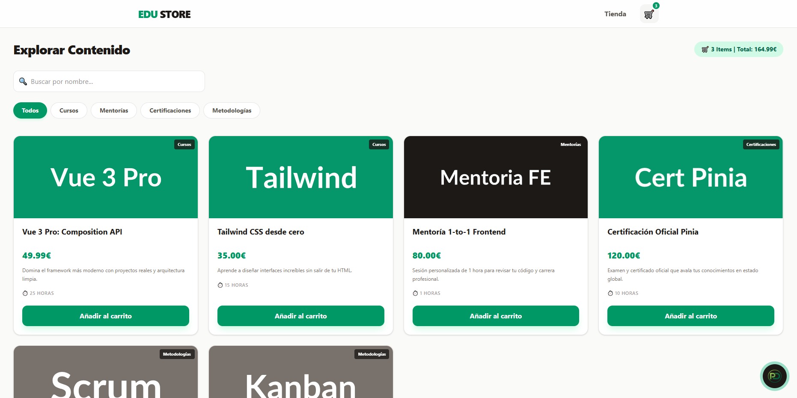

# EduStore - E-commerce Educativo

¡Bienvenido a **EduStore**! Una plataforma de aprendizaje moderna desarrollada como proyecto de alto rendimiento para demostrar el dominio del ecosistema **Vue 3**.

Este proyecto simula un flujo real de compra de cursos, mentorías y certificaciones, priorizando la experiencia de usuario (UX) y una arquitectura de código limpia y escalable.

## Tecnologías y Stack
- **Framework:** [Vue 3](https://vuejs.org/) (Composition API)
- **Build Tool:** [Vite](https://vitejs.dev/)
- **Estado Global:** [Pinia](https://pinia.vuejs.org/) (con persistencia en LocalStorage)
- **Navegación:** [Vue Router 4](https://router.vuejs.org/)
- **Estilos:** [Tailwind CSS v4](https://tailwindcss.com/) (Paleta custom Emerald & Stone)
- **Despliegue:** [Vercel](https://vercel.com/)

## Características Principales
- **Filtrado Inteligente:** Buscador en tiempo real y filtros por categoría (Cursos, Mentorías, etc.) mediante *Computed Properties*.
- **Carrito Persistente:** Uso de *Watchers* y *LocalStorage* para que el usuario no pierda su selección al recargar.
- **Mini-Cart Lateral (Drawer):** Carrito animado accesible desde cualquier página mediante `<Teleport>` y `<Transition>`.
- **Diseño Responsivo:** Interfaz adaptada a móviles, tablets y escritorio con alineación perfecta de elementos mediante Flexbox.
- **Componente Híbrido:** Integración y migración exitosa de lógica desde React a Vue 3 (Floating Profile Button).

## Screenshots

### Home Page


## Instalación y Configuración

🛠️ Instalación y Configuración
1. Clonar el repositorio:

```bash
git clone https://github.com/PedroDelgado4/ecommerce.git
```
2. Entrar en la carpeta:

```bash
cd ecommerce
```
3. Instalar dependencias:

```bash
npm install
```
4. Ejecutar en modo desarrollo:

```bash
npm run dev
```
5. Construir para producción:

```bash
npm run build
```

Desarrollado con ❤️ por F. Pedro Delgado